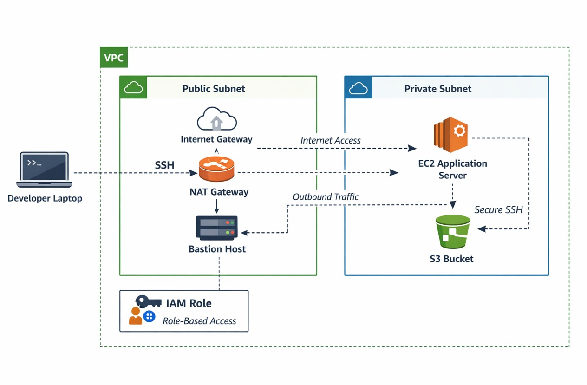
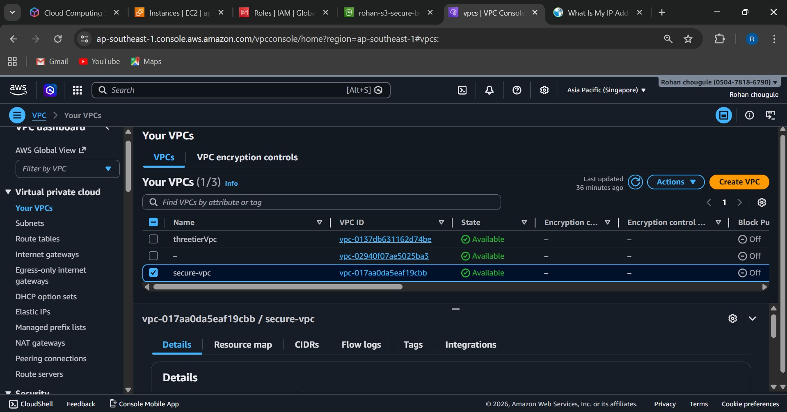
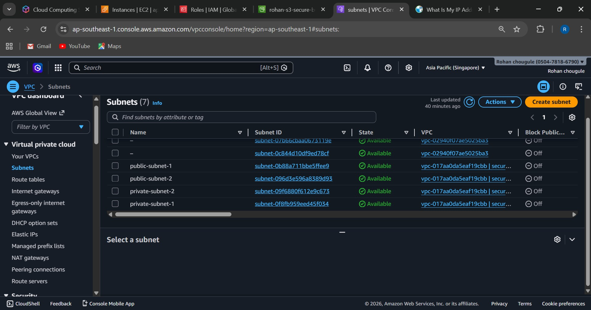
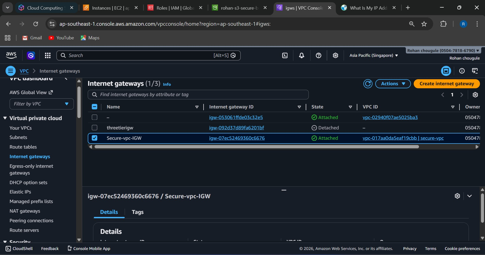
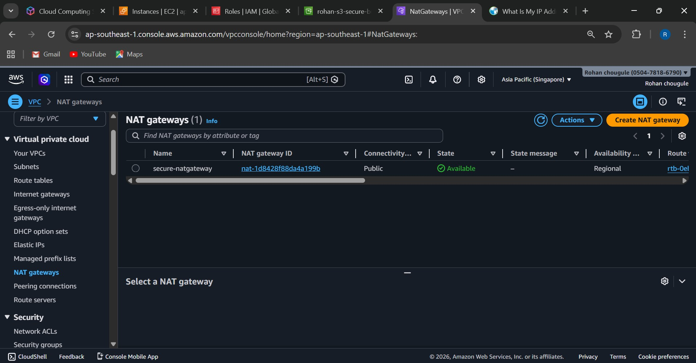
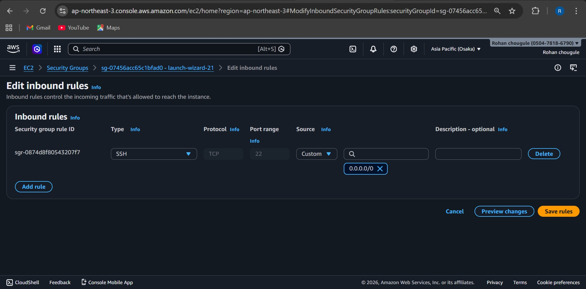

# Secure Private Infrastructure Deployment with Bastion Access and IAM Role-Based Architecture

### Project Overview
---
This project demonstrates how to design and deploy a secure AWS infrastructure following production-grade security practices.

The architecture ensures that application servers remain completely private, preventing direct internet exposure. All administrative access to backend servers is controlled through a Bastion Host, and AWS IAM Roles are used instead of hardcoded credentials to follow the least privilege security model.

This project simulates a real-world fintech security requirement, where protecting backend systems and eliminating insecure access methods is critical.

---
### Architecture Diagram
---

---
### Architecture Components
---

---
**1. Virtual Private Cloud (VPC)**

A custom VPC was created to isolate the infrastructure.



---

**Subnets**
<!DOCTYPE html>
<html>
<head>
    
</head>
<body>

<table border="1">
    <tr>
        <th>Subnet Type</th>
        <th>Purpose</th>
    </tr>
    <tr>
        <td>Public Subnet 1</td>
        <td>Bastion Host</td>
    </tr>
    <tr>
        <td>Public Subnet 2</td>
        <td>High Availability</td>
    </tr>
    <tr>
        <td>Private Subnet 1</td>
        <td>Application Server</td>
    </tr>
    <tr>
        <td>Private Subnet 2</td>
        <td>Future Scaling</td>
    </tr>
</table>

</body>
</html>



---
**Networking Configuration**  

Internet Gateway    

An Internet Gateway is attached to the VPC to allow internet access only to public subnets.



---

NAT Gateway

A NAT Gateway is deployed in the public subnet to allow private instances to access the internet for updates without exposing them publicly.



---

Route Tables

***Public Route Table*** 
```
Destination: 0.0.0.0/0
Target: Internet Gateway
```
***Private Route Table***
```
Destination: 0.0.0.0/0
Target: NAT Gateway
```

This ensures:

* Private servers cannot receive inbound internet traffic
* They can still download packages and updates
---
**Bastion Host Configuration**

A Bastion Host (Jump Server) was created to securely access private servers.

Configuration

* EC2 instance launched in Public Subnet
* Public IP enabled
* SSH access allowed only from developer IP

Security Hardening

**Security Group rules:**
<!DOCTYPE html>
<html>
<head>   
</head>
<body>

<table border="1">
    <tr>
        <th>Type</th>
        <th>Protocol</th>
        <th>Port</th>
        <th>Source</th>
    </tr>
    <tr>
        <td>SSH</td>
        <td>TCP</td>
        <td>22</td>
        <td>My IP only</td>
    </tr>
</table>

</body>
</html>



---

Additional security measures:
* Password login disabled
* SSH key authentication used
* Minimal inbound rules

Access Flow
```
Developer Laptop
       │
       ▼
Bastion Host (Public Subnet)
       │
       ▼
Private EC2 Server
```
**Private Application Server** The application server is deployed in the private subnet.

**Configuration**
* EC2 instance launched without public IP
* Security group allows SSH only from Bastion Host

**Security Group example:**
<!DOCTYPE html>
<html>
<head>
</head>
<body>
<h2></h2>

<table border="1" cellpadding="8" cellspacing="0">
    <tr>
        <th>Type</th>
        <th>Port</th>
        <th>Source</th>
    </tr>
    <tr>
        <td>SSH</td>
        <td>22</td>
        <td>Bastion Security Group</td>
    </tr>
    <tr>
        <td>HTTP</td>
        <td>80</td>
        <td>Internal Network</td>
    </tr>
</table>

</body>
</html>


**Web Server Setup**

Example installation:
```
sudo apt update
sudo apt install nginx -y
```

Test page deployed in:
```
/var/www/html/index.html
```


---

**IAM Role Implementation**

To follow best security practices, the application server does not store AWS credentials.
Instead, an IAM Role is attached.


**IAM Role Permissions**   
Example policy:
```
AmazonS3ReadOnlyAccess
```
This allows the EC2 instance to:
* Access S3 buckets
* Read files
* Without storing credentials

Verification  
Inside the private EC2 instance:
```
aws s3 ls
```
The command works without access keys, proving the IAM role is working.

---

### Security Validation
**1. Direct Access Blocked**   
Attempting to SSH directly into the private instance fails because:
* No public IP
* No internet route
* Security group restrictions

**2. Bastion Host Access**  
Successful login path:
```
Local Machine → Bastion Host → Private EC2
```
Example command:
```
ssh -i key.pem ubuntu@<bastion-public-ip>
```
Then:
```
ssh ubuntu@<private-ip>
```


---
 ### Security Design Principles Used
**1. Least Privilege Access**  
IAM roles provide only the required permissions.

**2. Network Isolation**   
Private subnets prevent direct internet exposure.

**3. Controlled Access**  
Only the Bastion Host allows SSH access.

**4. No Hardcoded Credentials**   
IAM roles replace access keys inside servers.

---
### Technologies Used
<!DOCTYPE html>
<html>
<head>
</head>
<body>

<h2></h2>

<table border="1" cellpadding="8" cellspacing="0">
    <tr>
        <th>Technology</th>
        <th>Purpose</th>
    </tr>
    <tr>
        <td>AWS EC2</td>
        <td>Virtual servers</td>
    </tr>
    <tr>
        <td>AWS VPC</td>
        <td>Network isolation</td>
    </tr>
    <tr>
        <td>AWS IAM</td>
        <td>Secure access management</td>
    </tr>
    <tr>
        <td>AWS S3</td>
        <td>Storage service</td>
    </tr>
    <tr>
        <td>NAT Gateway</td>
        <td>Outbound internet for private servers</td>
    </tr>
    <tr>
        <td>Bastion Host</td>
        <td>Secure SSH access</td>
    </tr>
    <tr>
        <td>Nginx</td>
        <td>Web server</td>
    </tr>
</table>

</body>
</html>

---
### Project Workflow
1. Create custom VPC
2. Create public and private subnets
3. Attach Internet Gateway
4. Create NAT Gateway
5. Configure route tables
6. Launch Bastion Host in public subnet
7. Launch application server in private subnet
8. Install Nginx
9. Create IAM Role
10. Attach IAM Role to EC2
11. Validate secure access architecture

---
### Lessons Learned

Through this project, the following cloud security concepts were implemented:
* Designing secure VPC architectures
* Implementing Bastion Host access control
* Using IAM Roles instead of access keys
* Enforcing least privilege policies
* Understanding public vs private subnet security
* Implementing production-grade AWS network isolation

---
### Conclusion
This project demonstrates how to build a secure AWS infrastructure where application servers run in private subnets without public access. Access to the servers is controlled through a Bastion Host, and IAM Roles are used instead of storing credentials on servers.

The architecture follows least-privilege access, network isolation, and secure authentication practices, making it suitable for production environments where security is critical. 🔐

---

